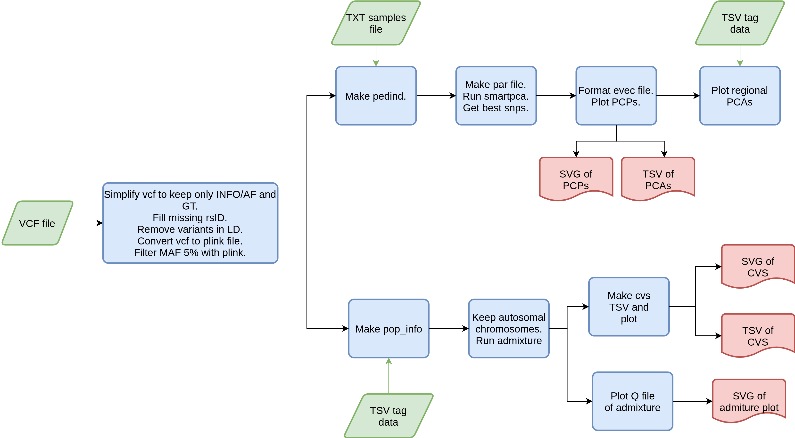

# VCF2PCP

Nextflow pipeline that runs and plots admixture and smartpca from a compressed VCF.

---

### Workflow overview


---


### Features
  **-v 0.0.1**

* Supports vcf compressed files as input.
* Results include PCA plot, PCP plot and admixture plots.
* Parameters of smartpca and admixture could be changed in Nextflow config.
* Scalability and reproducibility via a Nextflow-based framework.


---
## Requirements
#### Compatible OS*:
* [Ubuntu 18.04.03 LTS](http://releases.ubuntu.com/18.04/)

\* VCF2PCP may run in other UNIX based OS and versions, but testing is required.

#### Software:
| Requirement | Version  | Required Commands * |
|:---------:|:--------:|:-------------------:|
| [bcftools](https://samtools.github.io/bcftools/) | 1.9-220-gc65ba41 | bcftools |
| [plink](https://www.cog-genomics.org/plink/2.0/) | 2 | plink |
| [Eigensoft](https://data.broadinstitute.org/alkesgroup/EIGENSOFT/) | 6.1.4 | smartpca |
| [Admixture](http://software.genetics.ucla.edu/admixture/) | 1.3 | admixture |
| [Nextflow](https://www.nextflow.io/docs/latest/getstarted.html) | 19.04.1.5072 | nextflow |
| [Plan9 port](https://github.com/9fans/plan9port) | Latest (as of 10/01/2019 ) | mk \** |
| [R](https://www.r-project.org/) | 3.4.4 | ** See R scripts |

\* These commands must be accessible from your `$PATH` (*i.e.* you should be able to invoke them from your command line).  

\** Plan9 port builds many binaries, but you ONLY need the `mk` utility to be accessible from your command line.


---

### Installation
Download VCF2PCP from Github repository:  
```
git clone https://github.com/jbv2/VCF2PCP.git
```

---

#### Test
To test VCF2PCP execution using test data, run:
```
./runtest.sh
```
   Your console should print the Nextflow log for the run, once every process has been submitted, the following message will appear:

    ```
    ======
    vcf2pcp: Basic pipeline TEST SUCCESSFUL
    ======
    ```

VCF2PCP results for test data should be in the following file:
```
VCF2PCP/test/results/VCF2PCP-results
```

---

### Usage
To run VCF2PCP go to the pipeline directory and execute:
```
nextflow run vcf2pcp.nf --vcffile <path to input 1> [--output_dir path to results ]
```

For information about options and parameters, run:
```
nextflow run vcf2pcp.nf --help
```

---

### Pipeline Inputs
* A compressed vcf file with extension '.vcf.gz'.
Example line(s):
```
##fileformat=VCFv4.2
#CHROM  POS     ID      REF     ALT     QUAL    FILTER  INFO
chr21	5101724	.	G	A	.	PASS	AC=1;AF=0.00641;AN=152;DP=903;ANN=A|intron_variant|MODIFIER|GATD3B|ENSG00000280071|Transcript|ENST00000624810.3|protein_coding||4/5|ENST00000624810.3:c.357+19987C>T|||||||||-1|cds_start_NF&cds_end_NF|SNV|HGNC|HGNC:53816||5|||ENSP00000485439||A0A096LP73|UPI0004F23660|||||||chr21:g.5101724G>A||||||||||||||||||||||||||||2.079|0.034663||||||||||||||||||||||||||||||||||||||||||||||||||||||||||||||||||||||||||||||||
chr21	5102165	rs1373489291	G	T	.	PASS	AC=1;AF=0.00641;AN=140;DP=853;ANN=T|intron_variant|MODIFIER|GATD3B|ENSG00000280071|Transcript|ENST00000624810.3|protein_coding||4/5|ENST00000624810.3:c.357+19546C>A|||||||rs1373489291||-1|cds_start_NF&cds_end_NF|SNV|HGNC|HGNC:53816||5|||ENSP00000485439||A0A096LP73|UPI0004F23660|||||||chr21:g.5102165G>T||||||||||||||||||||||||||||5.009|0.275409||||||||||||||||||||||||||||||||||||||||||||||||||||||||||||||||||||||||||||||||
```

---

* A file that contains name of samples and the group that belongs to, separated by " ". `(samples.txt)`

Example line(s):
```
sample1 Zoque
sample2 PEL
sample3 PEL
sample4 CHB
...
```

* A file that contains sample, pop and region separated by tabs. `(tag_data.tsv)`. It helps for regions like north, central and south.

Example line(s):
```
sample  pop region
sample2 PEL PEL
sample3 PEL PEL
sample4 CHB CHB
...
```


### Pipeline Results

### smartpca
 * best snps
 * Tracy-Widom statistics
 * std out
 * PCP of first 20 PCs. This also says which is the last significant PC and variance explained by them.
 * Plot of PCA1 vs each PC(2:20).
 * PCP by region with first 20 PCs.
 * kmeans plot.

### admixture
* tsv and plot of CVS which shows the minor Crossvalidation value.
* admixture plots from k 2:9 separated and all together.

---

### Pipeline directory structure
````
VCF2PCP
├── dev_notes					## Developers notes directory
│   └── Workflow.png				## Flow diagram
├── mkmodules					## Directory for submodule organization
│   ├── mk-gather-admixture-plots			## Submodule to gather admixture plots.
│   ├── mk-keep-autosomes			## Submodule to select only autosomal chromosomes.
│   ├── mk-k-means-analysis			## Submodule to do kmeans analysis.
│   ├── mk-make-par-file_smartpca			## Submodule to run smartpca.
│   ├── mk-make-pedind			## Submodule to make pedind file.
│   ├── mk-make-pop-info 		## Submodule to make popinfo file.
│   ├── mk-parallel_coordinate_plot			## Submodule to make PCP.
│   ├── mk-plot-admixture			## Submodule to plot admixture results.
│   ├── mk-plot-cvs			## Submodule to plot cvs of admixture.
│   ├── mk-regional-PCA			## Submodule to perform regional PCA.
│   ├── mk-rejoin-vcf			## Submodule to rejoin vcf chunks.
│   ├── mk-run-admixture			## Submodule to run admixture.
│   ├── mk-simplifyVCF-removeLD			## Submodule to format vcf.
│   ├── mk-split-chromosomes 			## Submodule to split chromosomes.
│   └── mk-vcf2PLINK			## Submodule to convert vcf to plink
├── nextflow.config				## Configuration file for this pipeline.
├── README.md					## This document. General workflow description
├── runtest.sh					## Execution script for pipeline testing.
├── test							## Test directory.
│   ├── data						## Test data directory
│   └── reference						## Test reference directory
└── vcf2pcp.nf				## Flow control script of this pipeline.
````

---

#### References
Under the hood nf-vcf-novel-dataset-builder uses some coding tools, please include the following ciations in your work:

* Narasimhan, V., Danecek, P., Scally, A., Xue, Y., Tyler-Smith, C., & Durbin, R. (2016). BCFtools/RoH: a hidden Markov model approach for detecting autozygosity from next-generation sequencing data. Bioinformatics, 32(11), 1749-1751.
* Team, R. C. (2017). R: a language and environment for statistical computing. R Foundation for Statistical Computing, Vienna. http s. www. R-proje ct. org.
* Purcell, S., Neale, B., Todd-Brown, K., Thomas, L., Ferreira, M. A., Bender, D., ... & Sham, P. C. (2007). PLINK: a tool set for whole-genome association and population-based linkage analyses. The American journal of human genetics, 81(3), 559-575.
* D.H. Alexander, J. Novembre, and K. Lange. Fast model-based estimation of ancestry in unrelated individuals. Genome Research, 19:1655–1664, 2009.
* Price, Alkes L., et al. "Principal components analysis corrects for stratification in genome-wide association studies." Nature genetics 38.8 (2006): 904-909.
* Patterson, Nick, Alkes L. Price, and David Reich. "Population structure and eigenanalysis." PLoS genetics 2.12 (2006): e190.
---

### Contact
If you have questions, requests, or bugs to report, please email
<judith.vballesteros@gmail.com> or <iaguilaror@gmail.com>

#### Dev Team

Judith Ballesteros Villascán <judith.vballesteros@gmail.com>

Israel Aguilar-Ordonez <iaguilaror@gmail.com>

Fernando Pérez-Villatoro <frpvillatoro@gmail.com>

### Cite us
If you find this pipeline useful for your project, please cite us as:

Aguilar-Ordoñez, Israel, et al. "Whole genome variation in 27 Mexican indigenous populations, demographic and biomedical insights." PloS one 16.4 (2021): e0249773.
