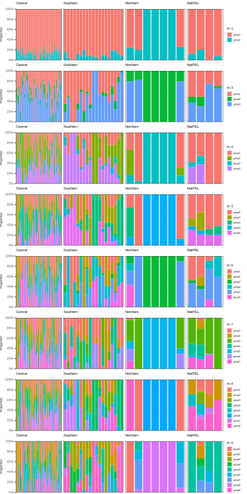

# mk-gather-admixture-plots
**Author(s):**

* Israel Aguilar-Ordoñez (iaguilaror@gmail.com)

**Date:** March 2020 

---

## Module description:
Plots all admixture results in one file by using plotter.R

* plotter.R is a tool for plotting k 2:9 from admixture results.

## Module Dependencies:
plotter.R

### Input(s):

* A `.rds` file with onformation of the plot for each K.

### Outputs:

* A `.rds` file with onformation of the plot for each K.

* A `.svg` for the plot of each K.



## Module parameters:
NONE

## Testing the module:

1. Test this module locally by running,
```
bash testmodule.sh
```

2. `[>>>] Module Test Successful` should be printed in the console...

## mk-gather-admixture-plots directory structure

````
mk-gather-admixture-plots /				    ## Module main directory
├── mkfile						   		## File in mk format, specifying the rules for building every result requested by runmk.sh
├── readme.md							## This document. General workflow description.
├── runmk.sh								## Script to print every file required by this module
├── plotter.R          					 ## Script used in this module.
├── test									## Test directory
│   ├── data								## Test data directory. Contains input files for testing.
└── testmodule.sh							## Script to test module functunality using test data
````
## References
* Purcell, S., Neale, B., Todd-Brown, K., Thomas, L., Ferreira, M. A., Bender, D., ... & Sham, P. C. (2007). PLINK: a tool set for whole-genome association and population-based linkage analyses. The American journal of human genetics, 81(3), 559-575.
* D.H. Alexander, J. Novembre, and K. Lange. Fast model-based estimation of ancestry in unrelated individuals. Genome Research, 19:1655–1664, 2009.