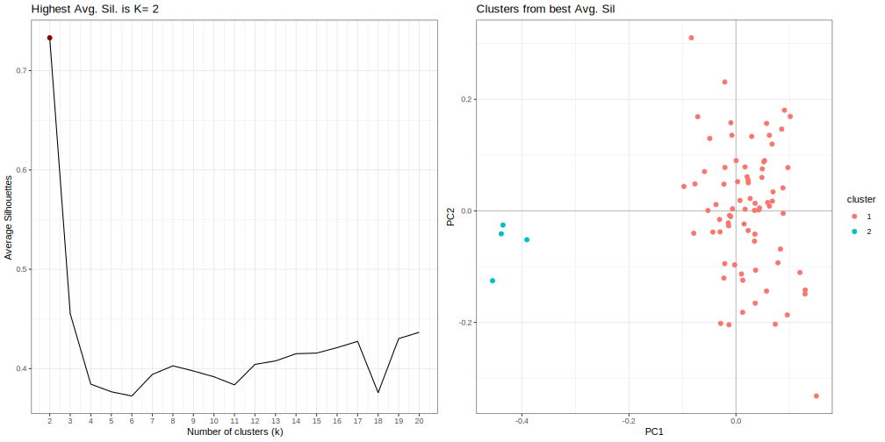

# mk-k-means-analysis
**Author(s):**

* Israel Aguilar-Ordoñez (iaguilaror@gmail.com)

**Date:** March 2020 

---

## Module description:
Gets k means from significant PCs using kmean.R

* kmean.R is a tool for making groups (k) fro significant PCs.


## Module Dependencies:
kmean.R

### Input(s):
* A `.smartpca.stdout` file.


### Outputs:

* A `.kmeans.svg` file.



## Module parameters:
NONE

## Testing the module:

1. Test this module locally by running,
```
bash testmodule.sh
```

## mk-parallel_coordinate_plot directory structure

````
mk-parallel_coordinate_plot /				    ## Module main directory
├── mkfile						   		## File in mk format, specifying the rules for building every result requested by runmk.sh
├── readme.md							## This document. General workflow description.
├── runmk.sh								## Script to print every file required by this module
├── kmeans.R					 ## Script used in this module.
├── test									## Test directory
│   ├── data								## Test data directory. Contains input files for testing.
└── testmodule.sh							## Script to test module functunality using test data
````
