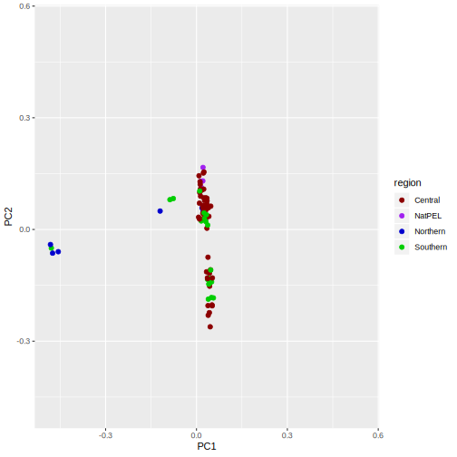
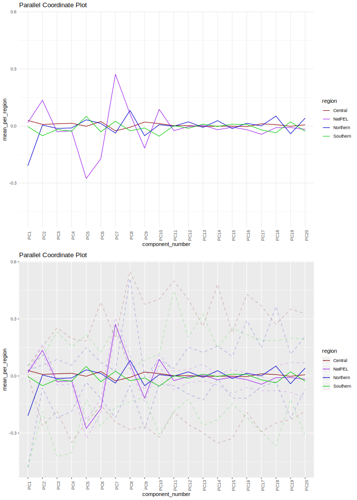

# mk-regional-PCA
**Author(s):**

* Israel Aguilar-Ordoñez (iaguilaror@gmail.com)

**Date:** March 2020 

---

## Module description:
Plots PCA of PC1 vs all PCs and makes PCP by region by using plotter.R

* plotter.R is a tool for making parallel coordinates plot by region.


## Module Dependencies:
plotter.R

### Input(s):

* A `.parallel_plot.PCA_df.tsv` file.

Example line(s):

```
sample  PC1     PC2     PC3     PC4     PC5     PC6     PC7     PC8     PC9     PC10    PC11    PC12    PC13    PC14    PC15    PC16    PC17    PC18    PC19    PC20    tag
GROUP1:sample1        -0.0767 0.0484  -0.1467 -0.1867 -0.1106 -0.0364 -0.0769 -0.0295 -0.0554 -0.1864 -0.0259 -0.1877 -0.0236 -0.1437 -0.0899 -0.0929 -0.0733 -0.0639 -0.273  -0.0132 Subgroup1
...
```
* A `.parallel_plot.tsv` file.

Example line(s):

```
sample  tag     component_number        value
GROUP1:sample1 Subgroup1     PC1     0.0215
GROUP1:sample2 Subgroup2     PC1     0.0148

...
```
* A `.parallel_plot.significant_pc.tsv` file.

Example line(s):

```
V1      V2      explained_variance_proportion   variance_proportion_percent     cumproportion
PC1     2.256303        0.562658834390297       56.3%   0.562658834390297
PC2     1.75377 0.437341165609703       43.7%   1
...
```

### Outputs:


* Many `.svg` of PC1 vs other PCs.

* A `.regionalPCA.svg` file.



## Module parameters:
Path of tag file:
TAG_FILE="test/reference/tag_data.tsv"

## Testing the module:

1. Test this module locally by running,
```
bash testmodule.sh
```

## mk-regional-PCA directory structure

````
mk-regional-PCA /				    ## Module main directory
├── mkfile						   		## File in mk format, specifying the rules for building every result requested by runmk.sh
├── readme.md							## This document. General workflow description.
├── runmk.sh								## Script to print every file required by this module
├── plotter.R					 ## Script used in this module.
├── test									## Test directory
│   ├── data								## Test data directory. Contains input files for testing.
└── testmodule.sh							## Script to test module functunality using test data
````
## References
* Price, Alkes L., et al. "Principal components analysis corrects for stratification in genome-wide association studies." Nature genetics 38.8 (2006): 904-909.
* Patterson, Nick, Alkes L. Price, and David Reich. "Population structure and eigenanalysis." PLoS genetics 2.12 (2006): e190.